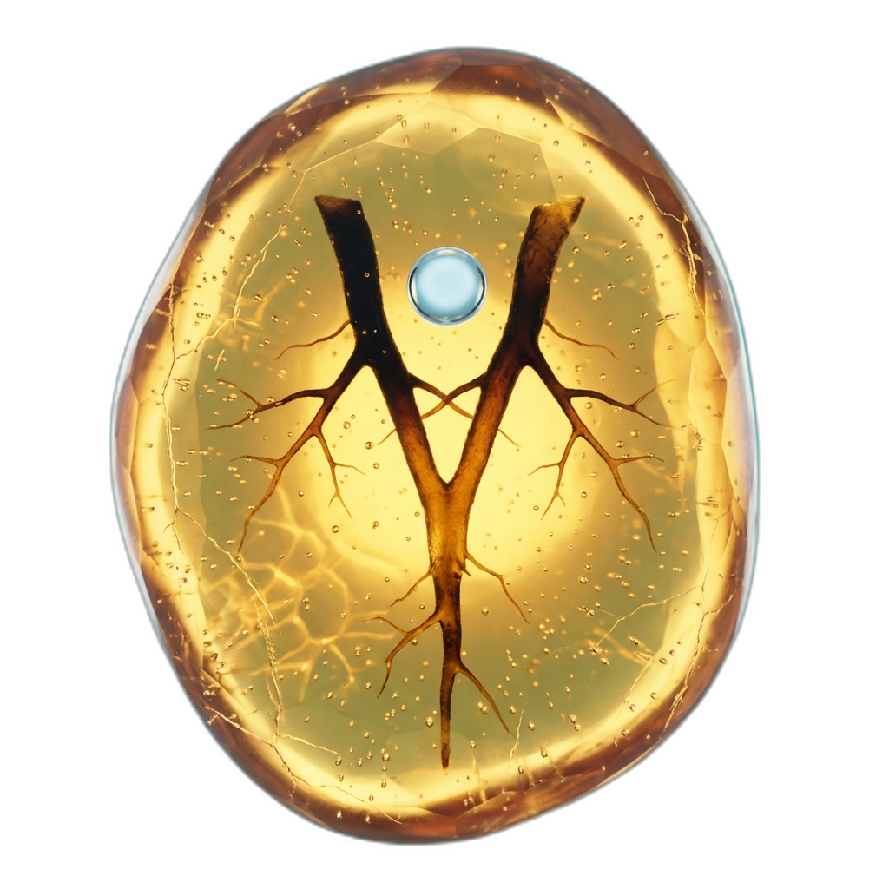

<p align="center">
  
</p>

<h3 align="center"><strong>Vedox</strong></h3>

<p align="center"><em>Your docs, your repo, your history.</em></p>

<p align="center">
  <a href="https://opensource.org/licenses/MIT"></a>
  <a href="https://github.com/thepixelabs/vedox/actions"></a>
</p>

---

A local-first, Git-native documentation CMS. You write Markdown. Vedox indexes it in SQLite, serves a WYSIWYG editor on localhost, and commits your changes as Git history. No server. No account. No telemetry.

---

## What it is

Vedox is a monorepo with three apps:

| App | Stack | Purpose |
|---|---|---|
| `apps/cli` | Go 1.23, chi, cobra, SQLite | HTTP API server + file-watcher daemon |
| `apps/editor` | SvelteKit 5, Tiptap, CodeMirror | WYSIWYG + raw Markdown editor |
| `apps/www` | SvelteKit (static) | Marketing site at [vedox.pixelabs.net](https://vedox.pixelabs.net) |

And two shared packages:

| Package | Stack | Purpose |
|---|---|---|
| `packages/templates` | TypeScript, Zod | Frontmatter schemas for all document types |
| `packages/markdown-core` | WASM (Phase 2 placeholder) | Shared Markdown parsing (not yet implemented) |

---

## Quick start

**Prerequisites:** Go 1.23+, Node 20+, pnpm 9+, Git with `user.name` and `user.email` set.

```sh
git clone https://github.com/thepixelabs/vedox.git
cd vedox
pnpm install
```

Create a workspace config at the repository root:

```toml
# vedox.config.toml
port      = 5150
workspace = "."
profile   = "dev"
```

Start everything:

```sh
pnpm dev
```

This starts the Go API server on `http://127.0.0.1:5150` and the SvelteKit editor on `http://127.0.0.1:5151`. The editor proxies `/api/*` to the Go server.

To run the CLI alone:

```sh
go run ./apps/cli dev
```

---

## Features

**Editor.** Dual-mode WYSIWYG (Tiptap) and raw Markdown (CodeMirror 6) with seamless mode switching. Round-trip fidelity guaranteed: `serialize(parse(md)) === md`. Mermaid diagrams, Shiki syntax highlighting (15 languages), bubble toolbar, auto-save with 800ms debounce.

**Navigation.** Command palette (Cmd+K) with 4 modes: search, commands, tags, path navigation. Full-text search via SQLite FTS5 with BM25 ranking. Quick file open (Cmd+P). Multi-pane layout with drag-resizable dividers.

**Design system.** OKLCH color space with 5 curated themes (Graphite, Eclipse, Ember, Paper, Solar). 3 density modes. Variable fonts (Geist Sans, Fraunces, JetBrains Mono). Motion system with `prefers-reduced-motion` support.

**AI & agents.** AI review queue for grammar, clarity, structure, style. Provider config drawer for Claude Code, Codex, and Gemini CLI. HMAC-authed agent API with staging branch isolation.

**Developer experience.** Zero config start. Framework detection (Astro, MkDocs, Jekyll, Docusaurus). 5 document templates. Frontmatter linter with 16 rules. Workspace scanner with background indexing.

---

## Design system

Vedox uses an OKLCH-based design token system. See [docs/explanation/design-system.md](docs/explanation/design-system.md) for the full specification.

**Themes:** Graphite (default dark), Eclipse, Ember, Paper, Solar -- switch via Settings or Cmd+K.

**Density:** Compact, Comfortable (default), Cozy -- a single `--density` multiplier scales all spacing.

**Fonts:** Geist Sans (body), Fraunces (display headings), JetBrains Mono (code). Self-hosted as variable woff2 with metric-override fallbacks.

**Keyboard shortcuts:** See [docs/how-to/keyboard-shortcuts.md](docs/how-to/keyboard-shortcuts.md).

### Performance contract

| Action | Budget (p95) |
|---|---|
| Cold load | 250ms |
| Cmd+K first result | 50ms |
| File open | 50ms |
| Mode toggle | 100ms |
| File switch | 30ms |

Run `pnpm perf` locally or see `.github/workflows/perf.yml` for CI integration.

---

## Repo layout

```
vedox/
├── apps/
│   ├── cli/           Go backend (chi router, cobra CLI, SQLite, fsnotify)
│   ├── editor/        SvelteKit 5 dual-mode editor
│   └── www/           SvelteKit static marketing site
├── packages/
│   ├── templates/     Zod frontmatter schemas
│   └── markdown-core/ Phase 2 WASM placeholder
├── docs/              Vedox's own documentation (dogfooded -- read before writing)
├── go.work            Go workspace
├── turbo.json         Turborepo pipeline
└── vedox.config.toml  Workspace config (you create this)
```

---

## Common commands

```sh
pnpm dev           # start all apps
pnpm build         # build all apps
pnpm test          # run all tests
pnpm lint          # lint all packages

# CLI directly
go run ./apps/cli dev
go run ./apps/cli lint
go run ./apps/cli version

# Go tests with race detector (required)
cd apps/cli && go test -race -count=1 ./...

# CLI binary
cd apps/cli && make build   # → apps/cli/bin/vedox
```

---

## Key design decisions

- **Markdown is the source of truth.** Documents are plain `.md` files on disk. The SQLite index is a cache -- it can be rebuilt at any time with `vedox reindex`.
- **Zero outbound network calls.** The CLI server makes no telemetry, version-check, or DNS calls outside of serving `127.0.0.1`. This is a hard policy enforced in code review.
- **Git commits on publish.** Clicking "Publish" in the editor creates a Git commit. Your Git identity (`user.name`, `user.email`) is required -- the server checks this at startup.
- **Atomic writes.** The DocStore writes files via temp-file + fsync + rename to prevent partial writes.
- **Path-traversal protection and secret blocklist.** The DocStore rejects any path that resolves outside the workspace root, and refuses to read or write `.env`, `*.pem`, `*.key`, and similar files.

---

## Documentation

All documentation lives in `docs/`. Vedox dogfoods itself -- the `docs/` tree is authored and served by Vedox.

Before writing any documentation, read:

1. [`docs/WRITING_FRAMEWORK.md`](docs/WRITING_FRAMEWORK.md) -- content types, frontmatter schema, linter rules, agent contract
2. [`docs/DESIGN_FRAMEWORK.md`](docs/DESIGN_FRAMEWORK.md) -- visual, IA, and component conventions

Key docs for contributors:

- [`docs/contributing.md`](docs/contributing.md) -- full contributor guide: setup, testing, conventions, submitting changes
- [`docs/adr/001-markdown-as-source-of-truth.md`](docs/adr/001-markdown-as-source-of-truth.md) -- foundational architecture decision
- [`docs/explanation/dual-mode-editor.md`](docs/explanation/dual-mode-editor.md) -- how the Tiptap + CodeMirror dual-mode editor works

---

## CI

CI runs on every push and on pull requests targeting `main`. Required gates:

- **Go:** build, test (`go test ./...`), vet -- on ubuntu-latest and macos-latest
- **Node:** build, test (vitest), lint -- on ubuntu-latest and macos-latest

Windows is best-effort via WSL2 and is not a required gate.

The golden-file round-trip tests in `apps/editor/src/lib/editor/__tests__/roundtrip/` block merge if they fail.

---

## Contributing

See [`docs/contributing.md`](docs/contributing.md) for the full guide. Short version:

1. Fork the repo or create a branch from `main`
2. Run `pnpm test` and `go test -race -count=1 ./...` locally
3. Open a pull request against `main`

Vedox is a focused tool and we want to keep it that way. Features that add external dependencies or cloud connectivity will likely be declined.

---

## License

MIT. See [LICENSE](LICENSE) for details.

---

<p align="center"><em>Built by <a href="https://pixelabs.net">Pixelabs</a></em></p>
