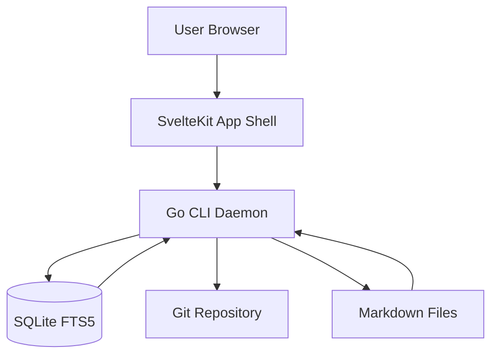
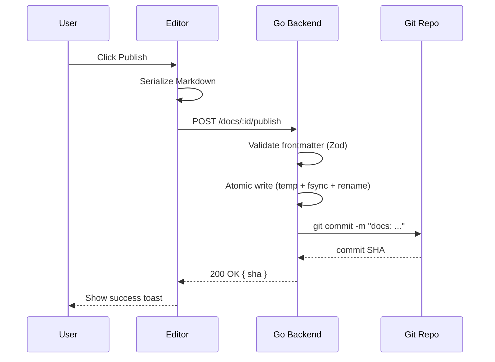
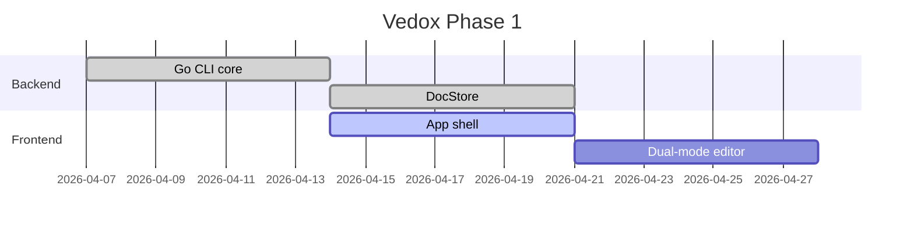

## Mermaid Diagrams

The system architecture is illustrated below.

```mermaid
graph TD
    A[User Browser] --> B[SvelteKit App Shell]
    B --> C[Go CLI Daemon]
    C --> D[(SQLite FTS5)]
    C --> E[Git Repository]
    C --> F[Markdown Files]
    D --> C
    F --> C
```

A sequence diagram showing the publish flow:

```mermaid
sequenceDiagram
    participant U as User
    participant E as Editor
    participant G as Go Backend
    participant R as Git Repo

    U->>E: Click Publish
    E->>E: Serialize Markdown
    E->>G: POST /docs/:id/publish
    G->>G: Validate frontmatter (Zod)
    G->>G: Atomic write (temp + fsync + rename)
    G->>R: git commit -m "docs: ..."
    R-->>G: commit SHA
    G-->>E: 200 OK { sha }
    E-->>U: Show success toast
```

A Gantt chart:

```mermaid
gantt
    title Vedox Phase 1
    dateFormat  YYYY-MM-DD
    section Backend
    Go CLI core        :done, 2026-04-07, 2026-04-14
    DocStore           :done, 2026-04-14, 2026-04-21
    section Frontend
    App shell          :active, 2026-04-14, 2026-04-21
    Dual-mode editor   :2026-04-21, 2026-04-28
```
