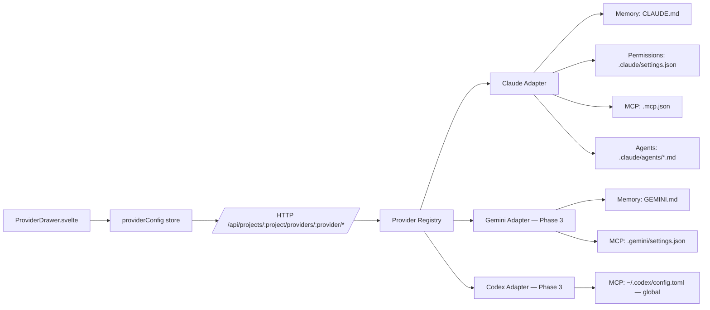
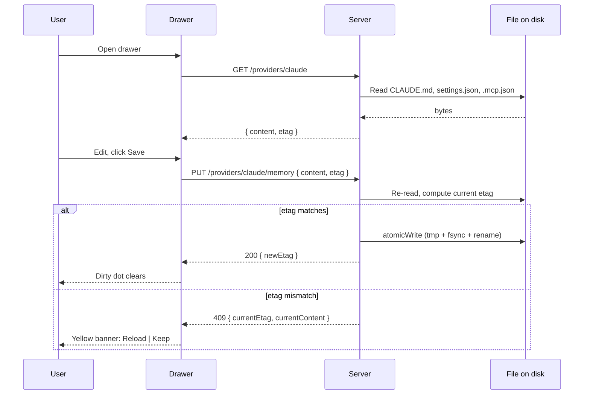

# Provider Drawer Architecture

## Overview

The provider drawer is a per-project right-anchored panel in the Vedox editor that manages AI provider configuration files (`CLAUDE.md`, `.claude/settings.json`, `.mcp.json`, `.claude/agents/*.md`, and later equivalents for Gemini, Codex, Cursor, and Aider) through a structured UI rather than raw text editing. It exists because every AI coding tool ships its own config file format, in its own location, with its own schema. Asking users to remember which file lives where, which keys are valid, and which writes need to be atomic is a tax that grows with each new tool.

The drawer's job is to remove that tax without becoming a leaky abstraction over the underlying files. Three design choices follow from that goal: wrap rather than unify, navigate by concern rather than by provider, and treat conflicts as a first-class UX state rather than an error.

## Wrap, Don't Unify

The drawer does not try to define a universal schema for "AI tool config." That would require the drawer to know every provider's keys ahead of time, to translate between them, and to keep that translation in sync as providers change. Instead, each provider gets its own adapter, and adapters expose **capabilities** — typed slots that the UI can render. The current capability set is: Memory, Permissions, MCP, Agents, Hooks, and Skills. A provider that supports a capability registers an adapter for it; a provider that does not, simply does not appear under that tab.

The consequence is that adding a new provider is a folder drop, not a schema migration. The cost is that each adapter has its own quirks (Codex stores config globally; Aider reads three files in precedence order; Cursor's rules supersede `.cursorrules`). The drawer surfaces those quirks rather than hiding them, because hiding them turns surprising behavior into invisible bugs.

## Navigate by Concern, Not by Provider

The drawer's tabs are Memory, Permissions, MCP, and Agents — not "Claude," "Gemini," "Codex." When two providers are configured for the same project, the Memory tab shows both `CLAUDE.md` and `GEMINI.md` with a colored left-border accent on each card to indicate ownership. This matches how users actually think about the work ("I want to write a permission rule," not "I want to open Claude's settings file"), and it makes cross-provider operations like the AGENTS.md fan-out (Phase 4) a natural extension rather than a special case.

The drawer header today reads "Claude Code Config" because Phase 1 ships only the Claude adapter. As Phase 3 lands the Gemini and Codex adapters, the header generalises and the per-tab provider accents become visible.

## Atomic Writes and Etag Conflict Detection

Every write the drawer issues goes through the same path on the server (`apps/cli/internal/api/providers.go`):

1. The client sends the new file content along with the sha256 etag of the version it loaded.
2. The server re-reads the file from disk and computes the current etag.
3. If the supplied etag does not match the current etag, the server returns HTTP 409 with the current content. The client shows a yellow banner with **Reload** and **Keep** buttons.
4. If the etags match, the server writes to a sibling `.tmp` file, calls `fsync`, and `rename`s into place. The write is atomic with respect to readers; a crash mid-write leaves either the old file or the new one, never a half-written file.

For structured files (`.claude/settings.json`, `.mcp.json`), the server unmarshals into `map[string]any`, mutates only the keys it owns (`permissions`, `mcpServers`), and re-marshals. Unknown top-level keys are preserved verbatim. The known limitation is comments: the standard JSON parser cannot round-trip `//` lines, so the server logs a warning when it detects them and writes the file without them. Replacing the parser with `hujson` is tracked as Phase 1.1 follow-up.

## Adapter Architecture

The HTTP layer dispatches `/providers/claude/*` to the Claude adapter, `/providers/gemini/*` to the Gemini adapter, and so on. Each adapter implements only the capability handlers it supports. The drawer's tabs query every loaded adapter for the capability they render and concatenate the results.

## Edit, Save, Conflict Flow

## Why Not a Merge Editor

A three-way merge UI would let the user resolve conflicts inline. The drawer deliberately does not ship one. Config files are small and structured; the realistic conflict cases are "I changed it from another shell" and "my teammate pushed a new rule," both of which are resolved faster by reloading and re-applying than by merging. A merge editor would also be the most expensive piece of UI in the drawer and would compete with the editor's main code-mode merge tooling for maintenance attention. The Reload / Keep banner is the explicit choice: surface the conflict, name both options, let the user decide.

## See Also

- [How to Manage Claude Code Config from Vedox](../how-to/manage-claude-code-config.md)
- [How to Manage Gemini Config from Vedox](../how-to/manage-gemini-config.md)
- [How to Manage Codex Config from Vedox](../how-to/manage-codex-config.md)
- [Provider drawer conflict](../runbooks/provider-drawer-conflict.md)
- [ADR 001: Markdown as source of truth](../adr/001-markdown-as-source-of-truth.md)
